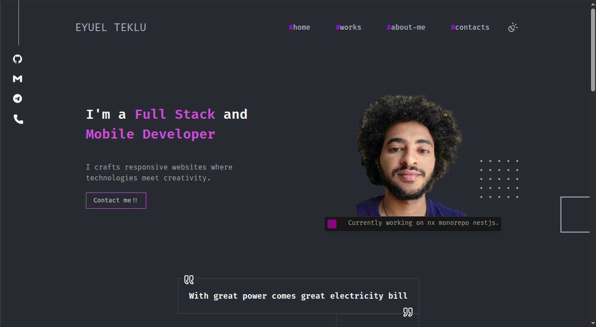

# 👨‍💻 Eyuel Teklu – Portfolio

<p align="center">
  <strong>Modern, responsive, and animated developer portfolio built with Next.js, TypeScript, and Tailwind CSS.</strong>
</p>

<p align="center">
  <a href="https://eyuelteklu.vercel.app">
    
  </a>
  
  
  
  
  
</p>

<p align="center">
  <a href="https://eyuelteklu.vercel.app">🌐 Live Website</a>
  •
  <a href="https://github.com/eyeyuel">GitHub</a>
  •
  <a href="YOUR_LINKEDIN_URL">LinkedIn</a>
</p>

---

## 📖 About The Project

This repository contains my personal portfolio website where I showcase my projects, technical skills, and experience as a **Full-Stack Developer**.

The portfolio focuses on:

* Clean and modern UI/UX
* Responsive design across all devices
* Smooth animations and micro-interactions
* Performance and accessibility
* Professional presentation of projects and skills

The goal of this project is to create a memorable experience while demonstrating my ability to build production-quality applications with modern web technologies.

---

## ✨ Features

* 📱 Fully Responsive Design
* 🌙 Dark & Light Mode
* ⚡ Smooth Animations and Page Transitions
* 🗂️ Project Showcase Section
* 👨‍💻 About Me & Skills Sections
* 🔍 SEO Optimization
* 📝 Open Graph & Metadata Support
* 🚀 Fast Performance and Optimized Assets
* ❌ Custom 404 Page

---

## 🛠️ Tech Stack

| Category      | Technologies            |
| ------------- | ----------------------- |
| Framework     | Next.js 14 (App Router) |
| Language      | TypeScript              |
| Styling       | Tailwind CSS            |
| UI Components | shadcn/ui               |
| Animations    | Motion                  |
| Icons         | Lucide React            |
| Fonts         | Fira Code               |
| Deployment    | Vercel                  |

---

## 📸 Preview

> Add a screenshot or GIF of your portfolio here.

```md

```

---

## 🚀 Getting Started

### Clone the Repository

```bash
git clone https://github.com/eyeyuel/portfolio.git
cd portfolio
```

### Install Dependencies

```bash
pnpm install
```

### Start Development Server

```bash
pnpm dev
```

Open:

```text
http://localhost:3000
```

---

## 📦 Available Scripts

| Command      | Description              |
| ------------ | ------------------------ |
| `pnpm dev`   | Start development server |
| `pnpm build` | Build for production     |
| `pnpm start` | Run production build     |
| `pnpm lint`  | Lint the project         |

---

## 🌐 Deployment

This project is deployed on **Vercel**.

Every push to the `main` branch automatically triggers a new production deployment.

To deploy your own version:

1. Fork or clone this repository.
2. Push it to your GitHub account.
3. Import the repository into Vercel.
4. Vercel will automatically detect the Next.js configuration and deploy the application.

---

## 📂 Project Structure

```text
src
├── app
├── components
├── hooks
├── lib
├── styles
└── types
```

---

## 📫 Contact

I'm currently open to:

* Full-Time Opportunities
* Freelance Projects
* Collaborations
* Open Source Contributions

**Email:** [eyueltklu27@gmail.com](mailto:eyueltklu27@gmail.com)

**Telegram:** @Eyuel_Teklu

**GitHub:** https://github.com/eyeyuel

**LinkedIn:** YOUR_LINKEDIN_URL

---

## 📄 License

This project is licensed under the MIT License.

---

<p align="center">
  Built with ❤️ by <strong>Eyuel Teklu</strong>
</p>
